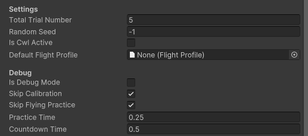
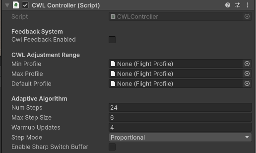
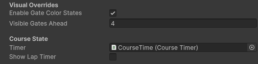
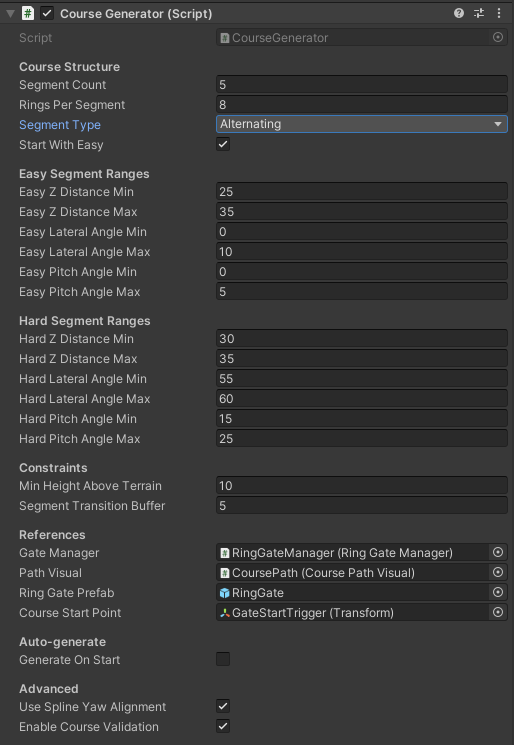

# Unity Drone Swarm Simulator 

**Inspired** by [this work](https://github.com/UAVs-at-Berkeley/UnityDroneSim)

*Have a look at their setup instruction if needed*

## Installation

1. Clone the repo

```bash
git clone https://github.com/lis-epfl/vr_swarm_simulation.git 
```

2. Launch Unity and install the following packages

- [Tobii Pro Fusion SDK (eye tracker)](https://s3-eu-west-1.amazonaws.com/tobiipro.sdk/tobiipro.sdk.unity.win.html)

- [AQUAS Lite Water shaders](https://assetstore.unity.com/packages/vfx/shaders/aquas-lite-built-in-render-pipeline-53519)

- On the first run of the simulation, you'll have to import the required packages for the Text Mesh Pro renderer (you'll see a message pop up from Unity)

3. Load the desired scene from Unity

## Racing Gate Experiment Setup

#### Experiment Manager Settings

> Note that all settings for the experiment when NOT in debug mode are "Hard Coded" inside the Experiment Manager Ring Gate class under the ```ExperimentSettings``` struct

```C#
private ExperimentSettings defaultSettings = new ExperimentSettings
{
    FlightPracticeDuration = 0.75f,
    CountdownTimeBetweentotalTrialNumber = 0.75f,
    NumberOfTrials = 5,
    NumberOfSegments = 5,
    NumberOfGatesPerSegment = 8
};
```



- **Total Trial Number** : specifiy the number of trials to be used per experiment (# of times to perform the course)
- **Random Seed** : for randomization of the gate placement
- **Is Cwl Active** : if checked, provide adaptation to the user based on cwl controller
- **Default Flight Profile** : Flight profile to be used if cwl controller is inactive

You can check the **skip** boxes to skip a specific step if for example the experiment ran into an issue and needs restart. Prevent the need of redoing the calibration or flight practice

#### Cognitive WorkLoad (CWL) controller settings



- **Cwl Feedback Enabled** : Similar setting as the "*Is cwl active*" above. If checked, cwl adjustments will take place.

- **Min/Max/Default profiles** : Used to specify the lower and upper bounds for the rate limits to be applied. The controller will create discrete steps in between those profiles. The default one is only used at the beginning of the first trial.

- **Steps config** : You can configure the number of discrete anchor steps to be evenly spaced in between the *min* and *max* profile. The max step size is used in proportional mode, where step size depends on the model output confidence of the estimated cwl level. 

- **Warmup Updates** : Used to specify the number of inferences to wait before adjustments take effect (buffering) at the beginning of each trial

- **Step mode** : Either *linear* or *proportionnal*, where linear is a fixed amount of steps taken depending on cwl output level whereas proportionnal uses the model confidence to further improve adjustments

#### Racing Gate Manager



- **Visible Gates Ahead** : Sets how many gates forward are visible to the user

- **Show Lap Timer** : If you want to show the timer overlay while the user is performing the racing course

#### Racing gate course settings

Here is where you can specify how the gates should be placed for the different segments of the racing course.




> Most of the settings have tooltips enabled, so by keeping the mouse cursor on a specific setting, it can provide more information.

The most important ones are the **Course Structure**, where you can set the number of segments for the entire course as well as the number of gates to be generated per segment. A **Segment Type** is used to specify if only *Easy* or *Hard* segemnts should be used, or to alternate between the 2 types.

The rest of the parameters are segment specific ranges to be used when randomly placing the gates within the defined limits.

## Additional Information

- For recording the experiment, I don't use the Unity Recorder as it limits the framerate and causes the simulation to be really slow, almost unusable. Instead, I use the screen recording builtin feature of *Windows* (win+ctrl+R shortcut to activate it)

- When running an experiment, I usually start the Unity simulation first, then the python experiment manager, to avoid any issues with the initialization of the shared memory buffers

- **Don't forget to change the experiment subject UID and the base folder to be able to easily find the recorded data**. Data won't be overwritten: instead it will append *_newer* to the filename so that you get a chance to recover the data if you forget to change between experiments.

